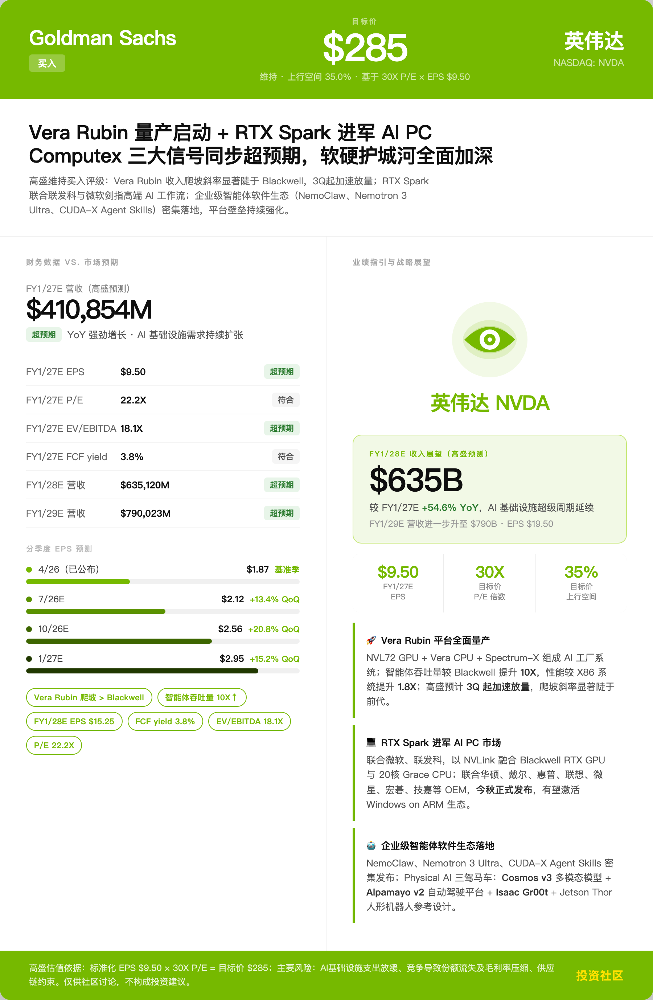
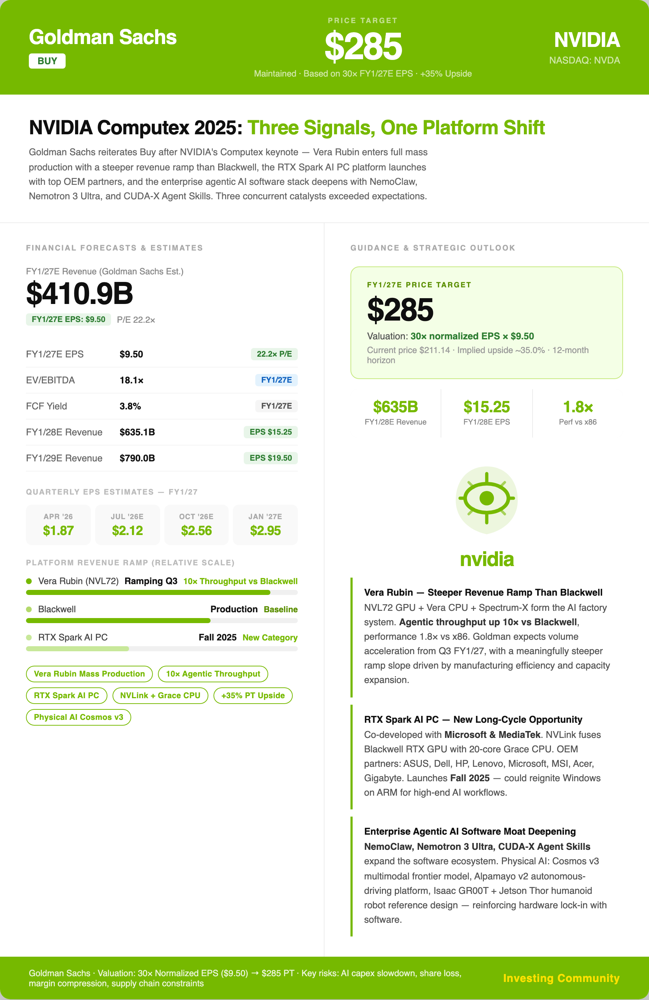
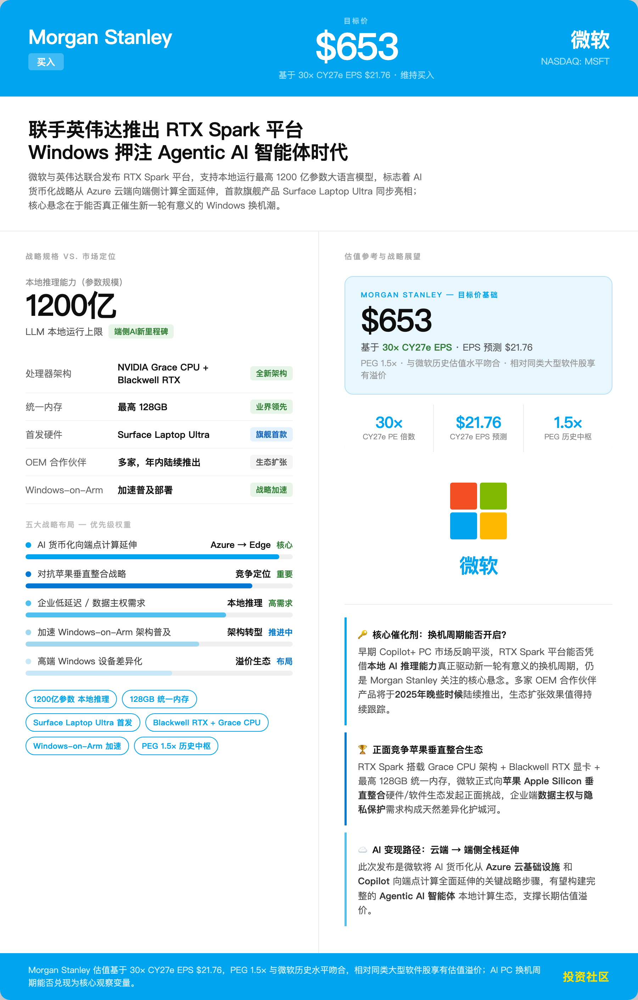
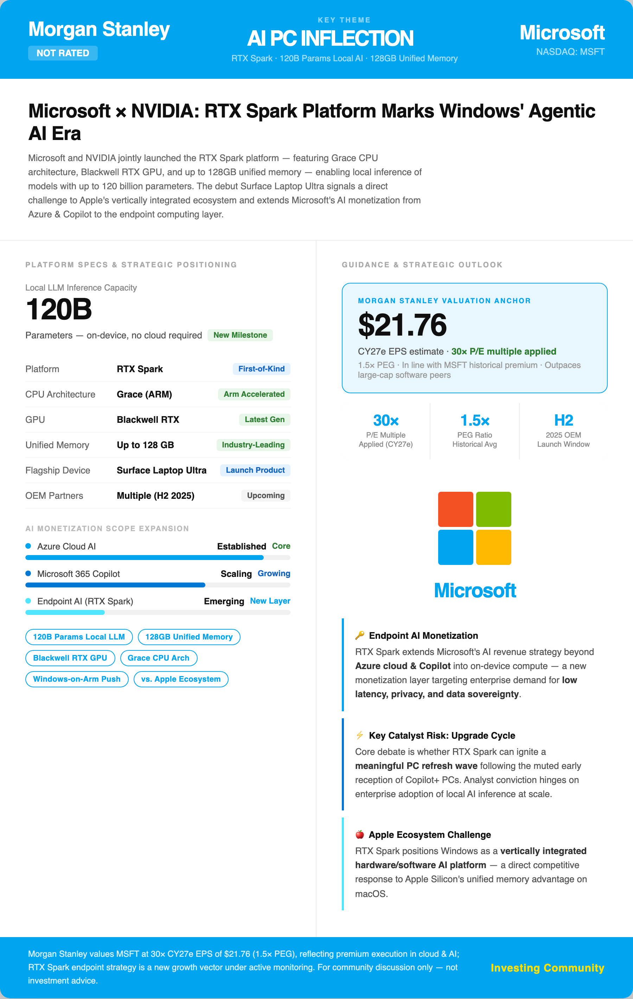
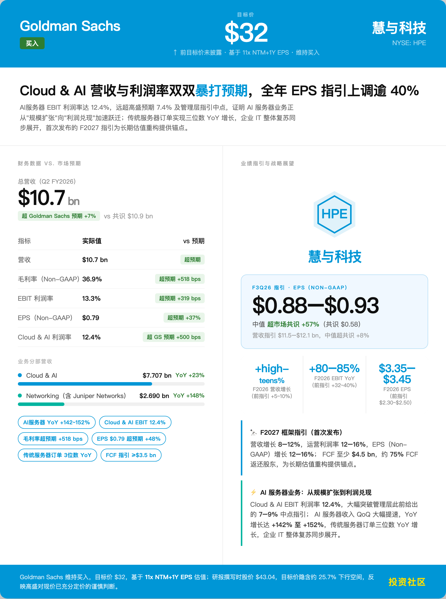
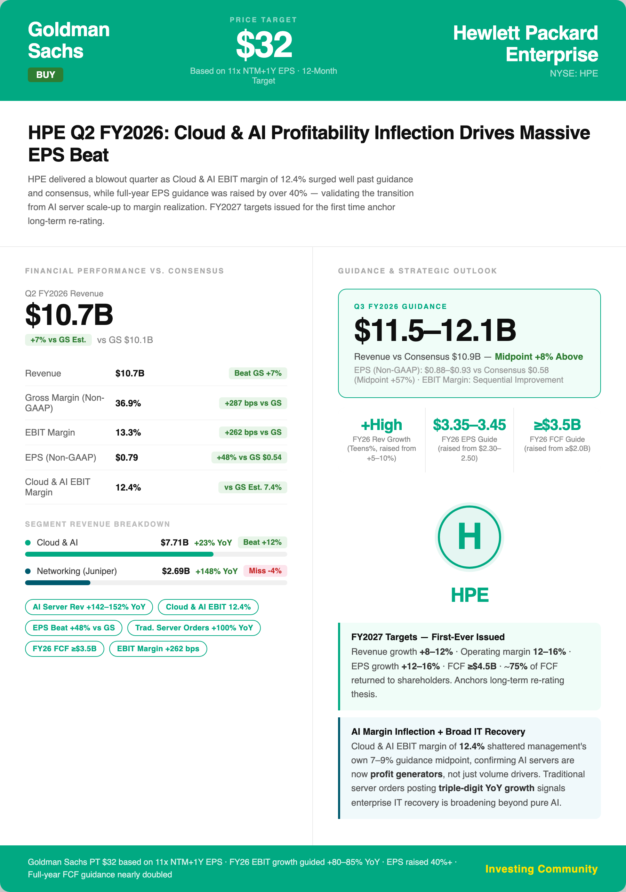
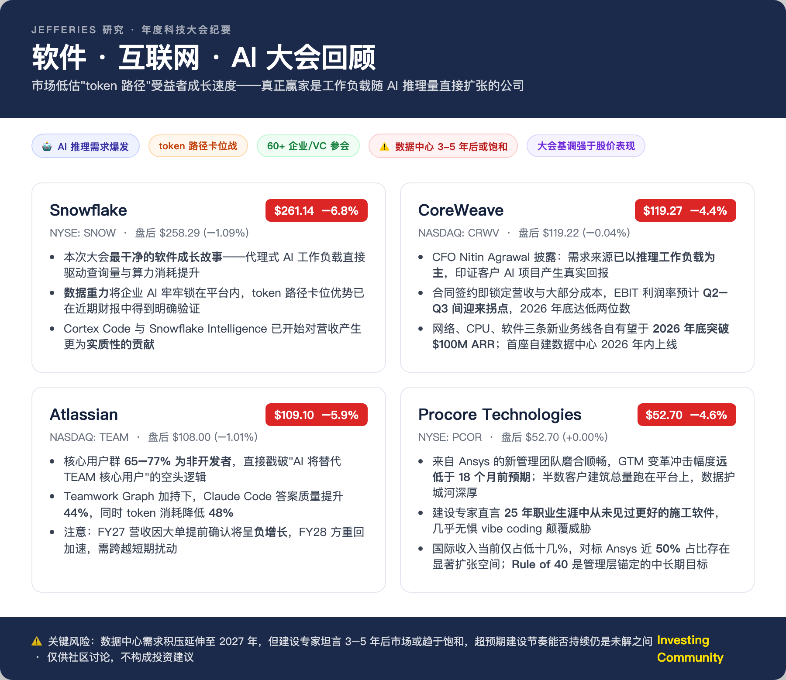
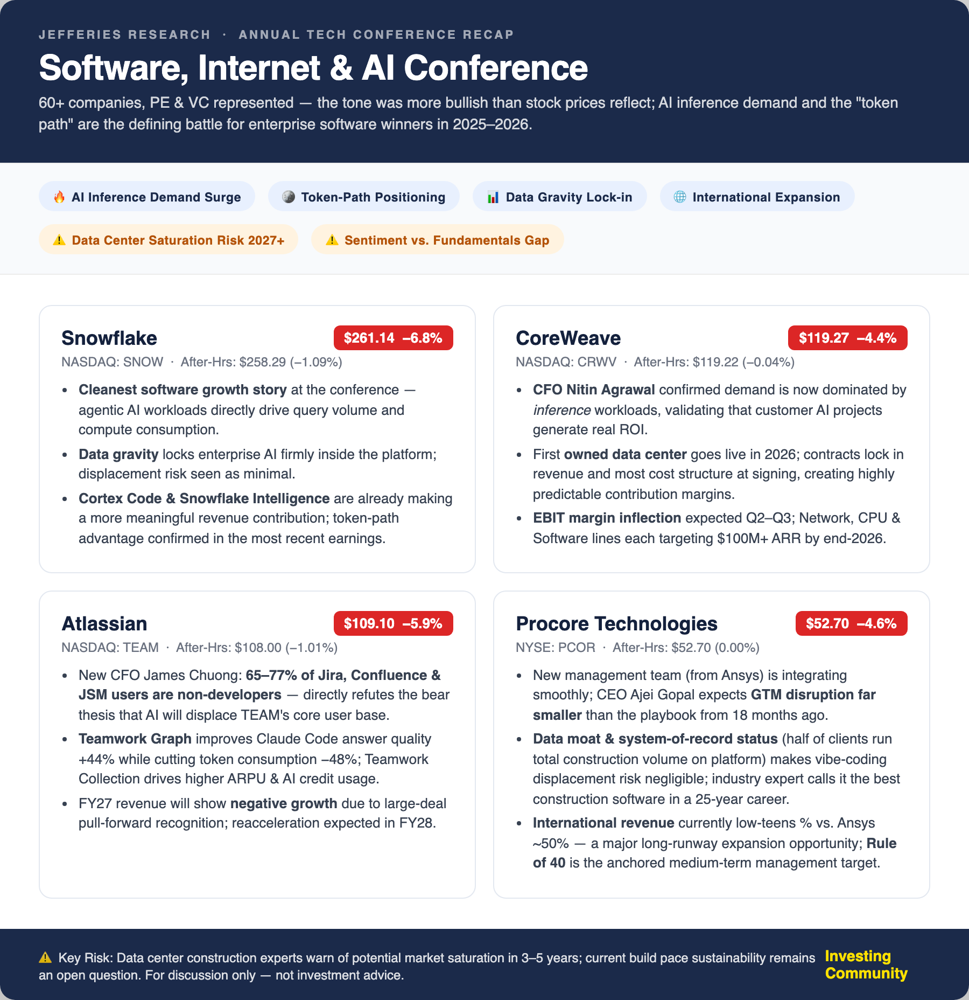
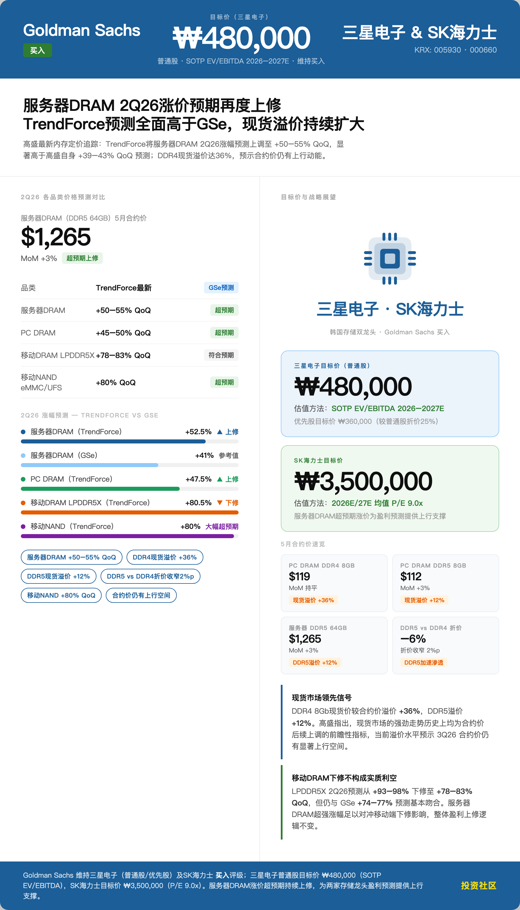
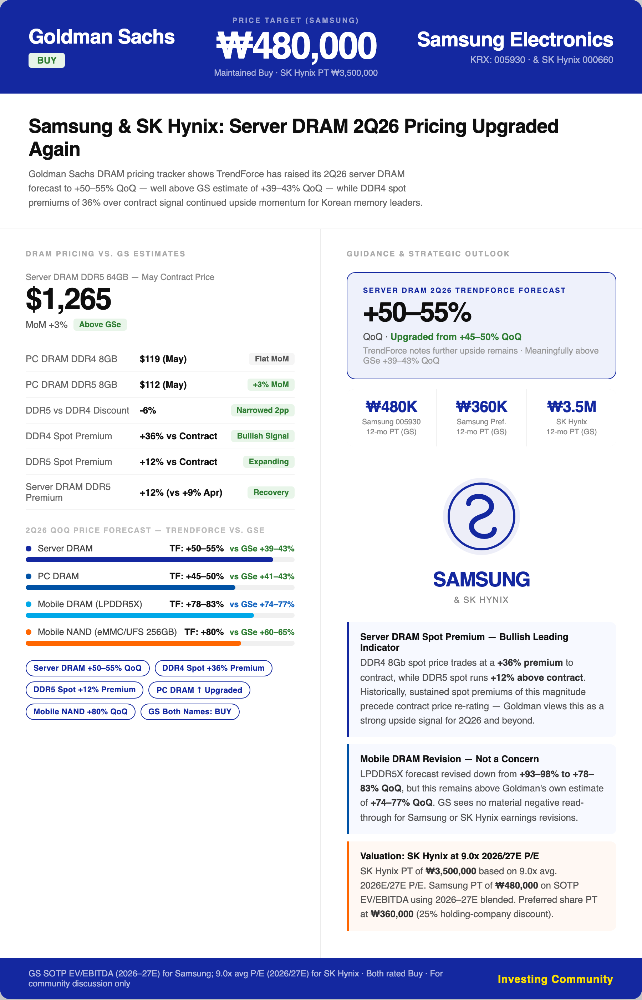

# Earnings Season Workflow

Earnings season automation: turn brokerage research PDFs into an **investment-community Chinese brief + English poster + Chinese poster**, then push them together to a Feishu (Lark) group.

## Modules

| File | Responsibility |
|------|------|
| `fetch_prices.py` | Tiger real-time quotes → `market_data.json` |
| `preprocess_pdfs.py` | PDF text extraction (on demand, when a PDF is corrupt) |
| `run_workflow.py` | Call Claude to generate the Chinese brief |
| `generate_posters.py` | Generate English/Chinese posters, composite watermark, push to Feishu |
| `push_feishu.py` | Feishu token / card building / image upload |

## Quick Start

```bash
# 1. Configure environment variables (see EARNINGS_SEASON.md)
export ANTHROPIC_AUTH_TOKEN=...   # or ANTHROPIC_API_KEY
export FEISHU_APP_SECRET=...
export FEISHU_WEBHOOK=...

# 2. Put research PDFs into 研报input/, then pull quotes
python3 fetch_prices.py APP NVDA COST ...

# 3. Generate the brief
python3 run_workflow.py

# 4. Generate posters and push
python3 generate_posters.py --push
```

See [EARNINGS_SEASON.md](EARNINGS_SEASON.md) for the full user manual, [workflow_tools.md](workflow_tools.md) for the tool breakdown, and [CLAUDE.md](CLAUDE.md) for the AI working rules.

## Notes

- All secrets are injected via environment variables; the repo contains no real credentials.
- `研报input/` (research input), `海报/` (posters), and `output/` are data and artifact directories, already excluded in `.gitignore`.

## Poster Examples

The workflow generates a bilingual (Chinese + English) poster for each earnings brief (900px; examples below are from the 2026-06-03 batch).

### NVIDIA (NVDA)
<p> </p>

### Microsoft (MSFT)
<p> </p>

### Hewlett Packard Enterprise (HPE)
<p> </p>

### Snowflake (SNOW)
<p> </p>

### Samsung Electronics (005930.KS)
<p> </p>
